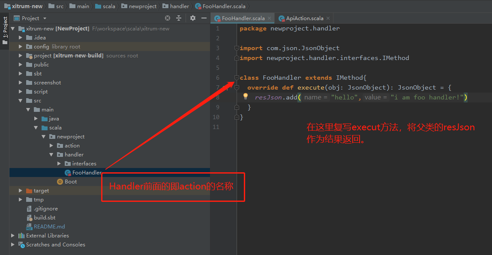
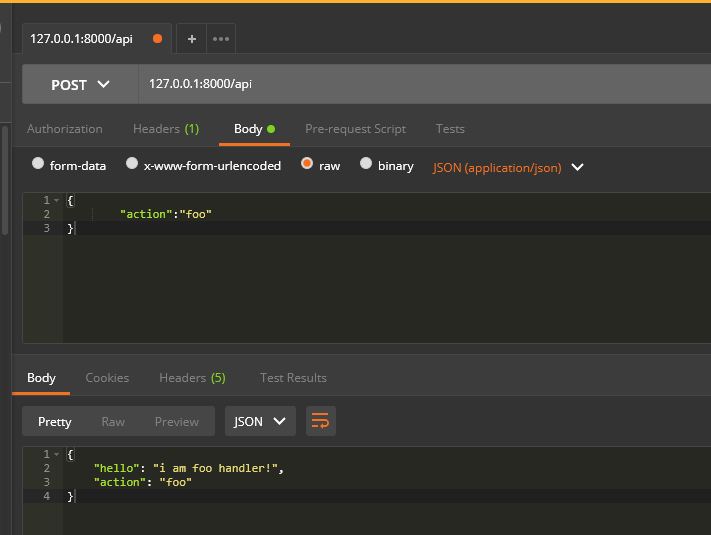

Xitrum Empty Service

>基于[Xitrum](https://github.com/xitrum-framework/xitrum),这是一个空的Xitrum框架,基于akka+netty，无需容器，打包生成jar，一个命令即可启动
    
## 开箱方法


## 调用方法


## 打包方法
命令行运行：
```bash
sbt xitrumPackage
```
在 `target/xitrum`文件夹下生成打包后的工程，拷贝至生产环境，执行以下命令即可开启服务。
```bash
./script/runner xxx.xxx.Boot
```


